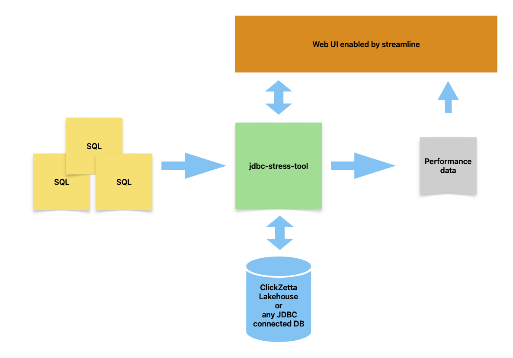
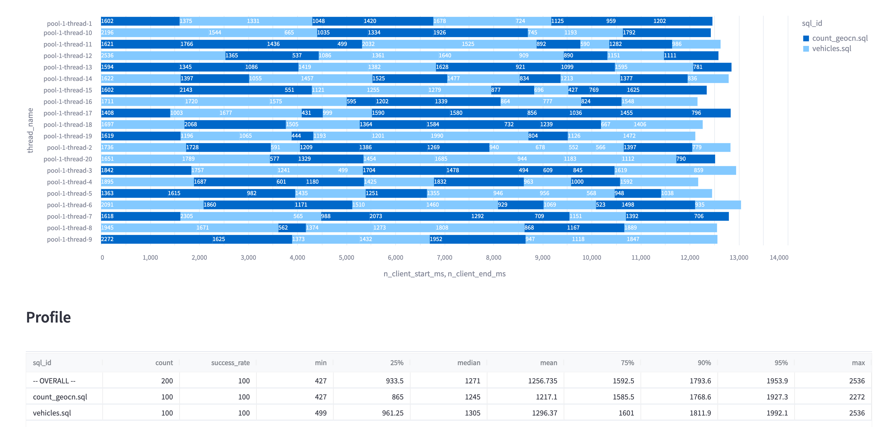

# ClickZetta Lakehouse JDBC Stress Tool

This is a JDBC stress tool developed by ClickZetta team.

1. Customizable SQL files and repeat times
2. Customizable JDBC driver, not only ClickZetta Lakehouse
3. Customizable concurrency
4. A streamlit powered WebUI for analyzing and visualization

Overview

Screenshot


## Getting Started

### Run in docker

1. Prepare image, `docker pull clickzetta/jdbc-stress-tool:dev` or `./build.sh` if you have Java 8+ develop environment ready
2. `docker run -p 8501:8501 -v .:/mnt/userdata clickzetta/jdbc-stress-tool:dev`
3. Open http://localhost:8051 in your browser

### Local compile and deploy

#### Compile jdbc-stress-tool

Have your Java(8+) development environment ready and run

`mvn package`

#### Run WebUI

Have your Python(3.9+) environment ready.

Get dependency packages installed
```shell
pip install -r streamlit/requirements.txt
```

Start WebUI
```shell
cd streamlit
./run.sh
```
